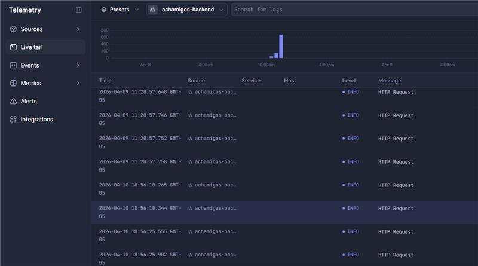
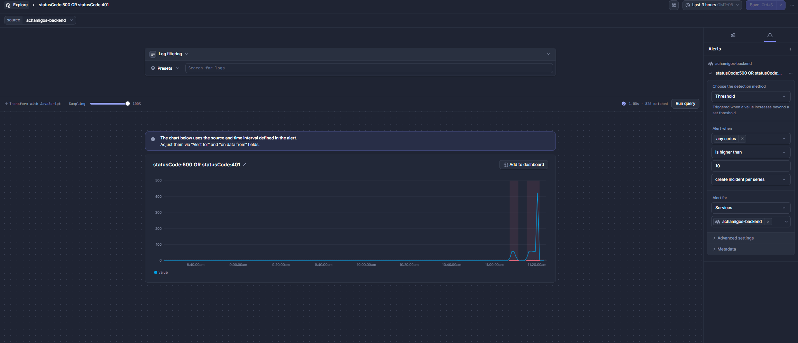
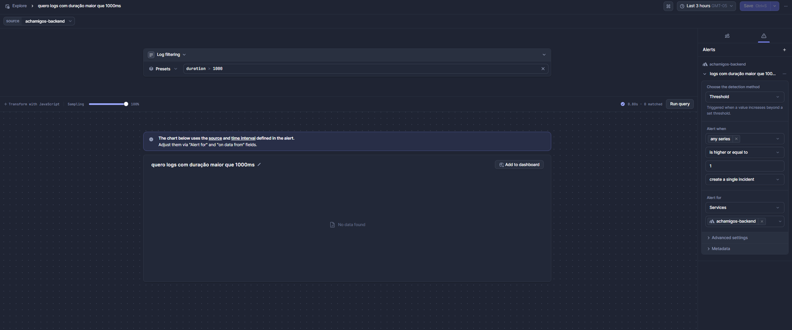
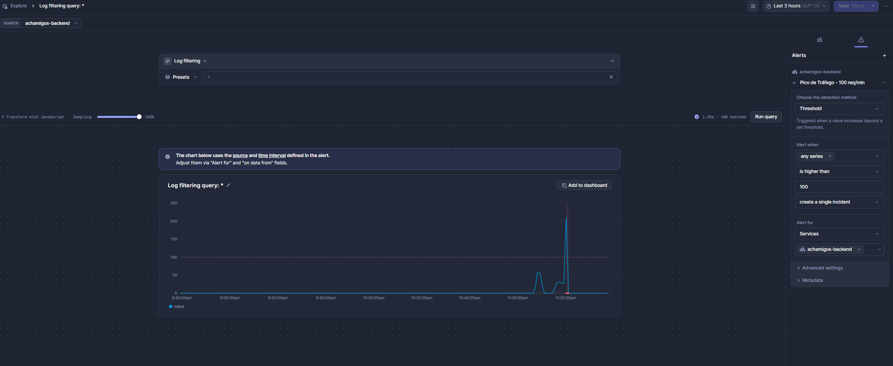
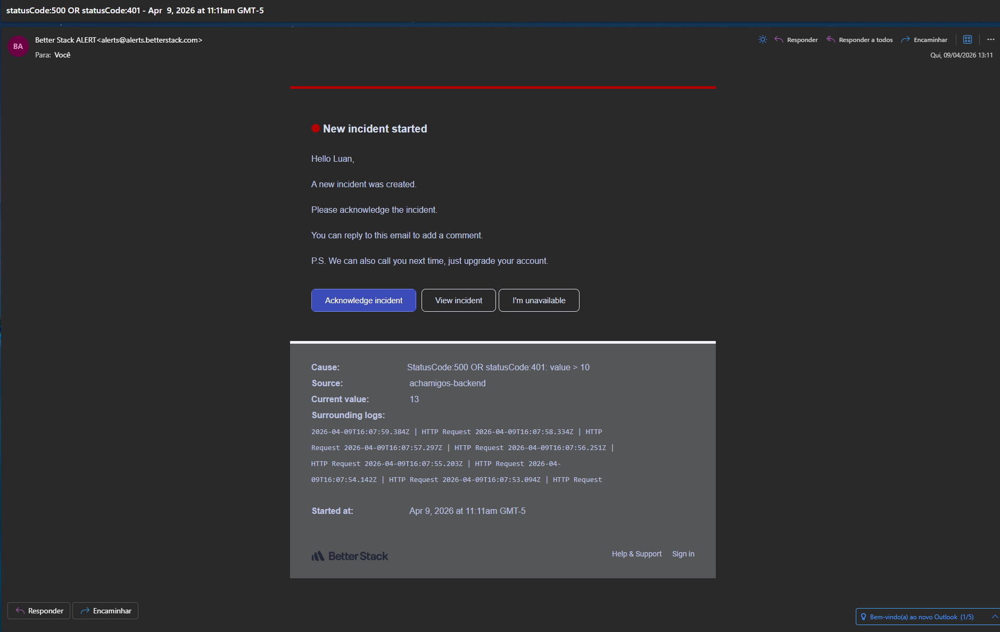
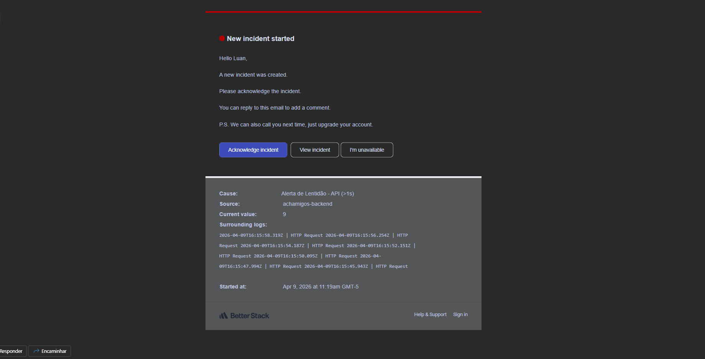
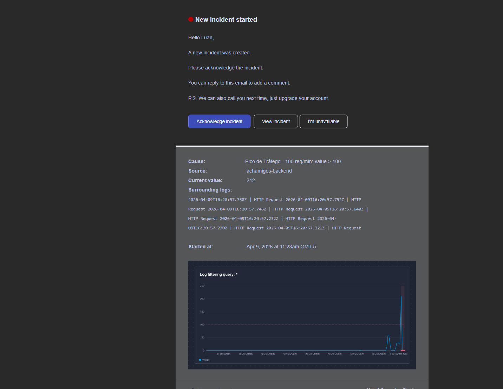

# API Achamigos - Backend TypeScript

API para gerenciamento de animais, usuários e eventos da plataforma Achamigos.

## Tecnologias


## Estrutura do Projeto

```text
├── api.ts                  # Arquivo principal da aplicação
├── tsconfig.json          # Configuração do TypeScript
├── swagger.ts             # Configuração do Swagger
├── controllers/           # Controladores da aplicação
├── models/               # Modelos do MongoDB
├── routes/               # Rotas da API
├── middleware/           # Middlewares (autenticação, etc)
├── services/             # Serviços (lógica de negócio)
├── types/                # Interfaces e tipos TypeScript
├── public/               # Arquivos estáticos (imagens)
└── dist/                 # Código compilado (gerado automaticamente)
```

## ⚙️ CI/CD

O projeto utiliza GitHub Actions para automação de processos.

### Fluxos automatizados

- Build da aplicação
- Geração de tags
- Build de imagens Docker
- Push para Docker Hub
- Deploy em homologação
- Deploy em produção
- Análise SonarCloud
- Notificação por e-mail em caso de falhas

## 🚀 Ambientes de Deploy

| Ambiente | Plataforma | URL |
|-----------|-----------|-----|
| Homologação | Render | [Acessar](https://achamigos-backend-hml.onrender.com) |
| Produção | Render | [Acessar](https://achamigos-backend.onrender.com) |
| Produção | Heroku | [Acessar](https://achamigos-backend.herokuapp.com) |

## 🐳 Docker Hub

Imagem disponível em:

[Acessar](https://hub.docker.com/repository/docker/luanzeralab/achamigos-backend)

Última versão:

```bash
docker pull luanzeralab/achamigos-backend:latest
```

## Instalação

1. Clone o repositório
2. Instale as dependências:
 
```bash
npm install
```

3. Crie um arquivo `.env` na raiz do projeto com as seguintes variáveis:

```env
MONGO_URI=sua_connection_string_mongodb
API_KEY=sua_chave_api
GEMINI_API_KEY=sua_chave_google_genai
GEMINI_MODEL=gemini-2.0-flash
PORT=3002
LOGTAIL_SOURCE_TOKEN=sua_logtail_token
```

## Scripts Disponíveis

### Desenvolvimento

```bash
npm run dev
```

Inicia o servidor em modo de desenvolvimento usando `ts-node` (não precisa compilar).

### Build

```bash
npm run build
```

Compila o TypeScript para JavaScript na pasta `dist/`.

### Produção

```bash
npm start
```

Inicia o servidor a partir do código compilado em `dist/`.

## Documentação da API

Acesse a documentação Swagger após iniciar o servidor:

```text
http://localhost:3002/docs
```

## Endpoints Principais

### Animais

- `GET /api/animais` - Lista todos os animais
- `GET /api/animais/:id` - Busca um animal por ID
- `POST /api/animais` - Cadastra um novo animal
- `PUT /api/animais/:id` - Atualiza um animal
- `DELETE /api/animais/:id` - Remove um animal
- `GET /api/animais/buscar` - Filtra animais por parâmetros

### Usuários

- `GET /api/users` - Lista todos os usuários
- `PUT /api/users/:id` - Atualiza um usuário
- `DELETE /api/users/:id` - Remove um usuário

### Eventos

- `GET /api/eventos` - Lista todos os eventos
- `POST /api/eventos` - Cadastra um novo evento
- `PUT /api/eventos/:id` - Atualiza um evento
- `DELETE /api/eventos/:id` - Remove um evento

## Autenticação

Todas as rotas da API requerem autenticação via API Key.

Adicione o header em todas as requisições:

```text
x-api-key: SUA_API_KEY
```

## 🤖 Integração com Google GenAI (Gemini)

Este projeto usa a SDK oficial `@google/genai` para gerar respostas com IA.

### 1) Dependencia

Se necessario, instale/atualize:

```bash
npm install @google/genai
```

### 2) Endpoint criado

- `POST /api/gerarTexto` - Envia prompt para o Gemini

### 3) Exemplo de chamada (backend)

Request:

```http
POST /api/gerarTexto
x-api-key: SUA_API_KEY
Content-Type: application/json

{
  "prompt": "Crie uma descricao curta para adoção de um cachorro idoso.",
  "systemInstruction": "Responda em portugues, em tom acolhedor.",
  "model": "gemini-2.0-flash",
  "saveHistory": true,
  "userId": "123"
}
```

Response:

```json
{
  "model": "gemini-2.0-flash",
  "response": "Texto gerado pelo Gemini...",
  "savedToHistory": true
}
```

### 4) Exemplo de consumo no frontend

```javascript
async function gerarTexto(prompt) {
  const response = await fetch('http://localhost:3002/api/gerarTexto', {
    method: 'POST',
    headers: {
      'Content-Type': 'application/json',
      'x-api-key': 'SUA_API_KEY_PUBLICA_DO_CLIENTE',
    },
    body: JSON.stringify({
      prompt,
      systemInstruction: 'Responda em portugues de forma objetiva.',
      saveHistory: false,
    }),
  })

  if (!response.ok) {
    const erro = await response.json()
    throw new Error(erro.message || 'Falha ao gerar texto')
  }

  const data = await response.json()
  return data.response
}
```

### 5) Segurança

- Nunca exponha `GEMINI_API_KEY` no frontend.
- A chamada ao Gemini e feita apenas no backend.
- O frontend conversa com o endpoint interno `/api/gerarTexto`.

### 6) Como rodar em container Docker

Pré-requisitos - Docker desktop instalado e aberto e arquivo .env
com LOGTAIL_SOURCE_TOKEN=sua_logtail_token. Aqui você pode colocar uma logtail fake
apenas para teste.

Criar a imagem Docker
No diretório raiz do backend (onde está o Dockerfile):

```bash
docker build -t backend-app .
docker run -d -p 3002:3002 --name backend-container backend-app
```

A aplicação estará acessível em: http://localhost:3002

Parar e remover o container
Para parar:

docker stop backend-container

Para remover:

docker rm backend-container

## 7) 📊 Observabilidade e Logs

O backend do projeto utiliza o Better Stack para monitoramento e análise de logs em tempo real.

### 🧾 Estrutura dos logs

Os logs são enviados de forma estruturada, contendo:

- método HTTP  
- rota acessada  
- status da resposta  
- tempo de resposta (`duration`)  
- mensagem do log  

---

### 📡 Integração

Os logs da API foram integrados ao Better Stack e validados com sucesso, garantindo o monitoramento das requisições.

---

### 🚨 Alertas configurados

- **Alta taxa de erros**  
  Dispara quando ocorrem erros `500` ou `401` mais de **10 vezes em 1 minuto**

- **Pico de requisições**  
  Dispara quando a API recebe mais de **100 requisições em 1 minuto**

- **Lentidão / performance**  
  Dispara quando o tempo de resposta (`duration`) é maior que **1000ms (1 segundo)**

---

### 📬 Notificações

Quando os alertas são atingidos, notificações são enviadas automaticamente por e-mail.

---

## 🔍 Qualidade de Código

O projeto utiliza SonarQube/SonarCloud para análise contínua de qualidade.

Métricas monitoradas:

- Bugs
- Vulnerabilidades
- Code Smells
- Cobertura de testes
- Duplicação de código

A análise é executada automaticamente via GitHub Actions.

### 🖼️ Evidências

- Logs no Better Stack  
- Alertas configurados  
- Notificações por e-mail  

### 📍 Logs no Better Stack






### 📍 Notificações por e-mail



